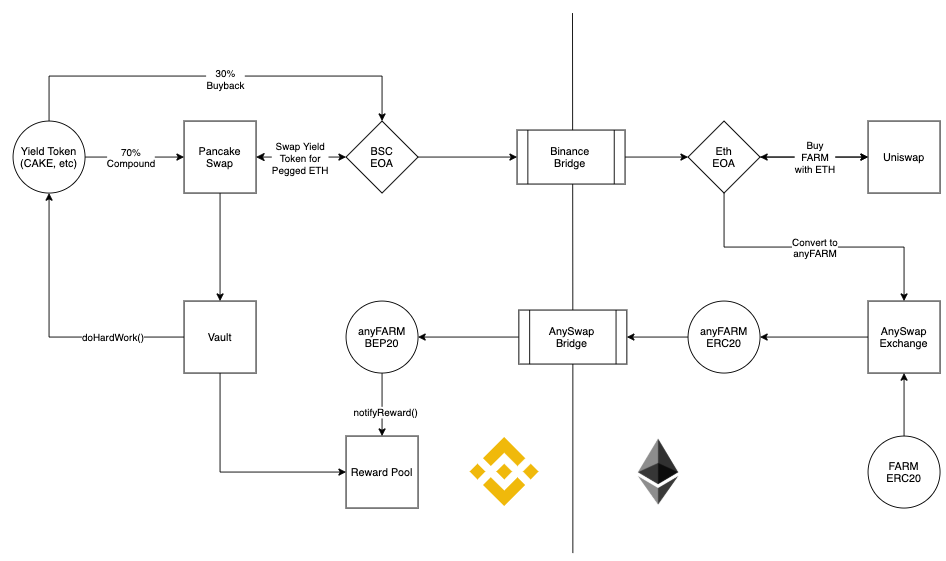
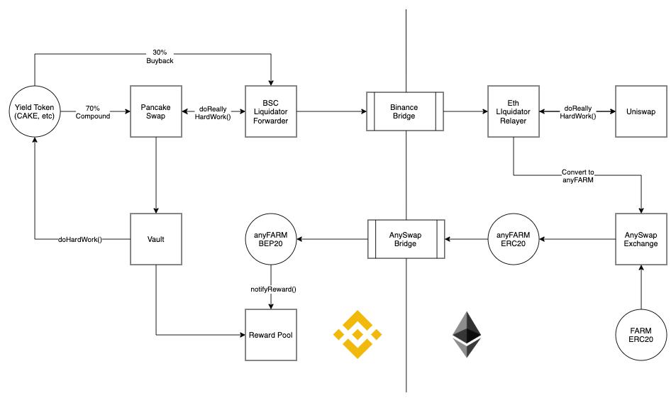
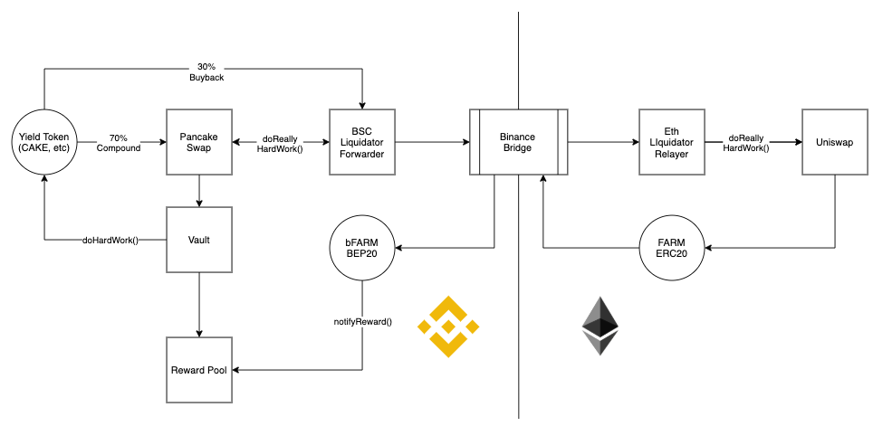

# Harvest Finance - Binance Smart Chain

## Introduction

Harvest Finance ([https://harvest.finance]) is an on-chain hedge fund which operates by automatically compounding various yield farming products on the Ethereum blockchain. Users deposit tokens into Harvest's Vaults to receive fTokens, which are a yield-bearing equivalent of the staking the token in the respective strategy. Harvest has several strategies to generate yield including utilizing Curve Finance, Mirror Protocol, and several others.

With the rising popularity of DeFi, there has been an exponential increase in the usage of the Ethereum network. Gas prices have become a hard limitation to user adoption that many dApp developers face today. As a result, chains which have interoperability functions with Ethereum, such as Binance Smart Chain (BSC), have begun to gain traction.

Harvest seeks to gain exposure on Binance Smart Chain where there are several unique yield farming opportunities as well as markedly lower gas fees. This document outlines the design of Harvest's interoperability with Binance Smart Chain and Ethereum.

## Requirements

- Governance & System Contracts
- Cross Chain Token
- BSC Yield Farming Vaults
  - Proxy Implementation
- BSC Yield Farming Strategies
  - PancakeSwap
  - Venus
- Staking Reward Pools

## Challenges

- Cross Chain Bridge: When moving tokens cross chain, the typical cross chain bridge provider will send those tokens to a custodial address on Ethereum then mint the corresponding amount on Binance Smart Chain. Tokens are burned from BSC when sent across the bridge. Most cross chain services rely on centralized relayers and EOA custodial addresses to accomplish this task. This imposes the risk of tokens being misused by the custodial EOA bridge provider as well as a dependency on off-chain, 3rd party operated systems. Binance offers its own custodial bridge service which would eliminate this risk, but tokens must apply through their project Token Canal program to be listed (permissioned system).

- Cross Chain Liquidity: Bridging onto another chain also presents the challenge of liquidity Binance Smart Chain. 30% of Vault yields are used for Profit Sharing on the Ethereum mainnet, where FARM is bought back from Uniswap and added as rewards to the Vault staking pools. Performing this strategy solely on BSC means there must be both a large enough (and likely incentivized) liquidity pool as well as additional risk of custodying large amounts of iFARM with the bridge provider.

## Design

The implementation of Harvest's cross chain compatibility works in three phases: Pre-Binance Bridge EOA, Pre-Binance Bridge Contract, and Post-Binance Bridge.

### Bridge Provider

The most important step in beginning development is deciding which project to permissionlessly peg the token onto BSC with and, therefore, custody iFARM tokens with on Ethereum.

I propose we use AnySwap Exchange [https://anyswap.exchange/]. AnySwap is a fully decentralized solution for cross chain swaps that runs on several chains, such as Ethereum, BSC, Fantom Chain, and more. Users run their own nodes in competition for validation rewards and AnySwap tokens. Code the cross chain bridge is also open sourced.

Any asset can be added to the AnySwap exchange and made into an anyAsset. The anyAsset can be moved freely cross chain, paying only the gas fees. When unwrapping an anyAsset to the base asset, a 0.1% fee is charged.

Others options include:

- BurgerSwap [https://burgerswap.org/] - One of the first BSC relayers, centralized and code is not open source
- JellySwap [https://jelly.market/] - Another decentralized cross chain relayer

### Pre-Binance Bridge EOA

The first iteration of development transfers the 30% profit sharing portion of BSC generated yield to an EOA address. That BSC EOA address then liquidates all tokens to Binance Pegged Ethereum on PancakeSwap. The EOA then sends the bETH across the Binance Bridge to an Ethereum EOA address. The Ethereum EOA uses the received ETH to buyback iFARM from Uniswap. The Ethereum EOA than converts the iFARM to anyiFARM and transfers it across the AnySwap bridge to the BSC EOA. The BSC EOA distributes rewards and calls necessary pool functions.

### Pre-Binance Bridge Contract

Use the same design as EOA, but create contracts with a `reallyHardWork()` method on BSC and Ethereum to handle cross-chain transfers and liquidations instead of relying on an external actor/script.

### Post-Binance Bridge

Use the contracts from above to handle cross-chain transfers and liquidations, but use the Binance Pegged FARM Token and update the Ethereum Bridge Contract to send FARM across the Binance Bridge.

## Future Work

Once we have reached the Post-Binance Bridge phase, we can begin to consider adding liquidity on PancakeSwap and incentivizing LP on BSC. With Binance acting as a trusted token custodian, the risk of relying on other services to do cross chain transfers and custody funds is greatly reduced.

## References

- AnySwap Cross Chain Bridge: [https://github.com/fsn-dev/crossChain-Bridge]
- Binance Bridge: [https://www.binance.org/en/bridge]
